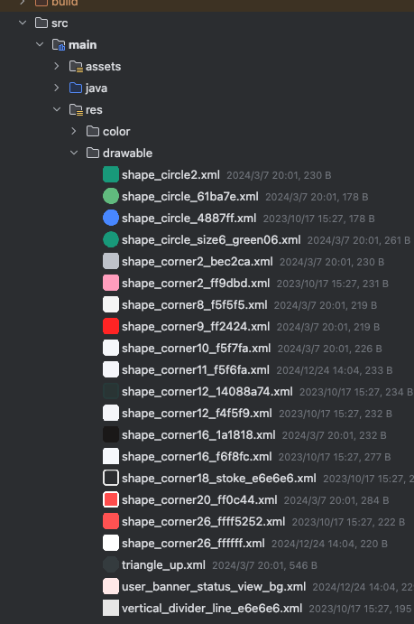

# Android drawable preview pro plugin

- Android studio and IntelliJ IDEA plugin that replaces default icons with drawables previews inside project view.
- Compatible with the latest IDE: Android Studio Meerkat (2024.3) or newer.

# Installation

1. Download [plugin zip archive](https://github.com/hust-twj/Android-drawable-preview-pro-plugin/releases/) from release page
2. Inside Android Studio go to File -> Settings -> Plugins -> Install plugin from disk
3. Select zip archive

## OR**

1. Inside Android Studio go to File -> Settings -> Plugins -> Browse repositories
2. Search Android Drawable Preview Pro**
3. Click Install Plugin
